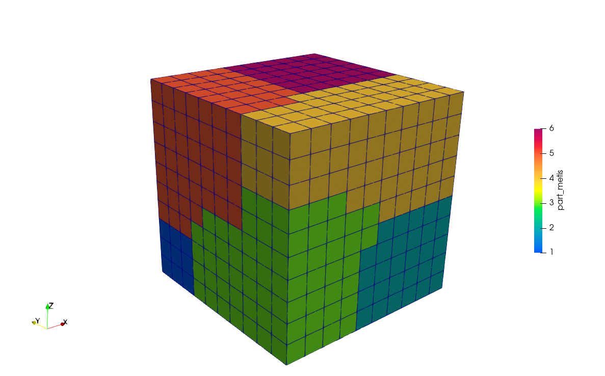

# prepar


[](https://github.com/lmn-labest/prepar/actions/workflows/build.yml)

Index
- [prepar](#prepar)
  - [Compilar o metis](#compilar-o-metis)
  - [Compilar o pre](#compilar-o-pre)
  - [Rodando o pre](#rodando-o-pre)
  - [Exemplo](#exemplo)
  - [Pre-compilados](#pre-compilados)
  - [Docker](#docker)


## Compilar o metis

Para compilar o metis basta seguir os seguintes passos:

```console
cd metisLib
tar -xvzf metis-5.1.0.tar.gz
cd metis-5.1.0
make config
make
mkdir -p ./../../lib/
cp -v build/Linux-x86_64/libmetis/libmetis.a ../../lib/
cd ../../
```

Estes comandos irão descompactar e compilar o metis5, configurarr o make, excetar a compilação e copiar automaticamente a `libmetis.a` para a pasta `lib`.


> OBS: As versões novas do metis que estão  disponiveis no `github` precisam dessa lib extra `libGKlib`. As versões mais antigas do `metis` podem ser encontrados [aqui](http://glaros.dtc.umn.edu/gkhome/metis/metis/download). As `prepar` só funciona com as versão antigas do `metis`.


## Compilar o pre

O primeiro passo é fazer uma copia do `Makefile_base`

```console
cp contrib/Makefile_base Makefile
```

Antes de compilar o `prepar` a estrutura do projeto tem que ser algo similar à:

```console
├── include
│   ├── elementos.fi
│   ├── gauss.fi
│   ├── load.fi
│   ├── parallel.fi
│   ├── readfile.fi
│   ├── string.fi
│   ├── termprop.fi
│   ├── time.fi
│   └── transiente.fi
├── lib
│   └── libmetis.a
├── Makefile
└── src
    ├── Adjacency.f
    ├── Filenames.f
    ├── Main.f
    ├── Malloc.f
    ├── Mpi_comunicate.f
    ├── Parallel_imp.f
    ├── Partdmesh.f
    ├── Pdmetis.f
    ├── Propnode.f
    ├── Rdata.f
    ├── Read_mef.f
    ├── Read_metis.f
    ├── Time.f
    ├── Vtk.f
    ├── Write_mef.f
    ├── Write_par.f
    └── Write_vtk.f
```

Agora para compilar fazer basta:

```console
make
```

O executavel do `prepar` estará na pasta `bin`.

## Rodando o pre

Criar um arquivo `pre.dat` com o conteudo

```
input  mesh.dat
output     part
div          12
method non-overllaping
partVtk     yes
partMeshVtk yes
partMeshMef yes
meshLoads    no
vtkBin      yes
memory     1000
end
```

Para rodar basta

```console
prepar solo/pre.dat
```

## Exemplo

Exsite um exemplo de aquivo de entrada na pastas  `contrib/bin/`. Para usa-lo primeiro vamos descompacta-lo para a pasta `bin/`.

```console
mkdir -p bin
tar -xvzf contrib/examples/solo.tar.gz -C bin/
```

Agora para gerar o particionamento basta executar o `prepar` na pasta `bin/solo/`.

```console
prepar pre.dat
```

Exemplo da malha particonada em 6 partições




## Pre-compilados

Versões pré compilados para `linux` pode ser encotradas aqui [binarios](https://github.com/lmn-labest/prepar/releases/tag/0.1.0)

## Docker

Gerando a imagem caso ainda não exita

```console
docker build -t prepar:latest .
```

Para executar o `prepar` e gerar o parcionamento gerar o parcionamento

```console
docker run --rm -it -v "$(pwd)/bin/solo/:/usr/build/solo/" prepar solo/pre.dat
```
